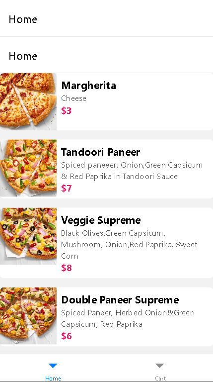
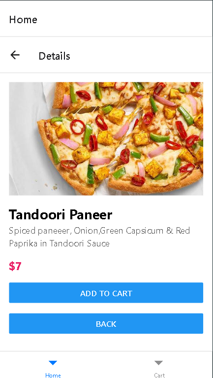
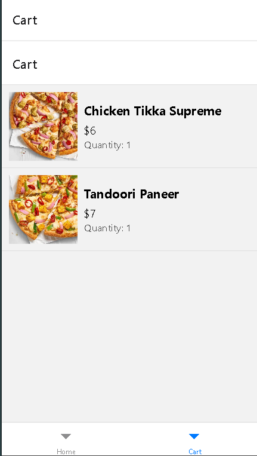

# React Native Pizza App


## Overview

The React Native Pizza App is a mobile application that allows users to browse a variety of pizzas and desserts, add them to a cart, and proceed to checkout. Built with TypeScript and Expo, this application provides a seamless and engaging user experience by integrating with a pizza and desserts API to fetch and display dynamic data.

## Features

- **Browse Pizzas:** View a comprehensive list of available pizzas with high-quality images, detailed descriptions, and prices.
- **Pizza Customization:** Customize your pizza by selecting different sizes and additional toppings before adding it to your cart.
- **Add to Cart:** Easily add selected pizzas to your shopping cart with a single tap.
- **Persistent Cart:** The cart items are stored locally using AsyncStorage, ensuring that the cart retains its contents even after the app is closed and reopened.
- **Navigation:** Navigate smoothly between different screens using React Navigation with a tab-based navigation system for Home and Cart screens.
- **API Integration:** Dynamically fetch and display pizza data from a RESTful API.
- **Responsive UI:** Designed to provide a consistent and responsive user experience across both iOS and Android devices.

## Screenshots


*Home Screen: Browse and select pizzas.*


*Pizza Details Screen: View pizza details and add to cart.*


*Cart Screen: Review selected items and proceed to checkout.*

## Installation

To set up the React Native Pizza App locally, follow these steps:

1. **Clone the repository:**

   ```bash
   git clone https://github.com/yourusername/react-native-pizza-app.git
   cd react-native-pizza-app
